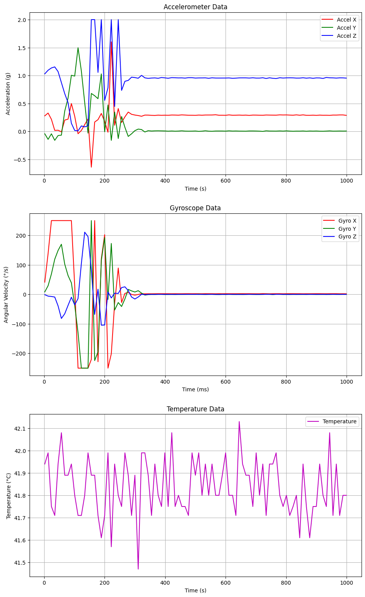

## 1. Introdução

Este relatório técnico detalha o processo de integração e análise do sensor de movimento MPU-6050 na plataforma de prototipagem BitDogLab V7. O componente selecionado é uma Unidade de Medição Inercial (IMU) de 6 eixos, que combina um acelerômetro e um giroscópio, permitindo leituras de aceleração linear e velocidade angular. O documento descreve a metodologia de hardware para a conexão via barramento I2C, bem como o desenvolvimento do software necessário para a aquisição e processamento dos dados. Uma ênfase particular é dada à análise dos dados de repouso, fundamental para compreender a resposta do sensor a condições físicas, como a inclinação da placa, e para identificar o viés inerente do giroscópio. Adicionalmente, o relatório analisa as leituras do sensor de temperatura embutido, esclarecendo seu funcionamento. O objetivo final é criar um exemplo funcional e documentado que sirva como referência técnica para projetos futuros que utilizem esta combinação de hardware.

## 2. Metodologia

A metodologia deste projeto focou na configuração e leitura de dados brutos da IMU MPU-6050, utilizando a plataforma BitDogLab V7 para capturar a resposta do sensor a um estímulo físico.

O hardware foi montado conectando-se o módulo MPU-6050 ao conector I2C 0 (J6) da BitDogLab. Esta interface corresponde aos pinos GPIO0 (SDA) e GPIO1 (SCL) da Raspberry Pi Pico. A alimentação do módulo (VDD e VLOGIC) foi fornecida pelo pino 3V3 da placa, e o pino ADO foi aterrado (GND) para fixar o endereço I²C do sensor em 0x68.

O software foi desenvolvido em MicroPython, utilizando o Thonny IDE. A biblioteca `machine.I2C` foi usada para estabelecer a comunicação com o sensor no barramento I2C0. O primeiro passo da implementação foi "acordar" o MPU-6050, que inicializa em modo "sleep" por padrão. Isso foi feito através de uma escrita I²C no registrador de Gerenciamento de Energia 1 (PWR\_MGMT\_1, endereço 0x6B), alterando seu valor para 0x00.

Para o procedimento experimental, foi criado um script que realiza leituras contínuas dos registradores de dados do acelerômetro e do giroscópio (endereços 0x3B a 0x48). Durante a execução do script, um estímulo físico súbito — um "peteleco" — foi aplicado diretamente no sensor. Os dados brutos de todos os eixos foram capturados em tempo real, sendo impressos no console do Thonny em um formato adequado (como CSV) para permitir a plotagem e análise posterior dos gráficos de resposta ao impacto.

Após a captura dos dados brutos, uma etapa adicional de processamento de sinal foi implementada no mesmo script MicroPython. Foi desenvolvido um filtro de média móvel simples, com uma janela de 5 pontos, para suavizar os dados adquiridos. Esta técnica consiste em armazenar as últimas cinco leituras de cada eixo em um buffer (como uma lista) e calcular a média aritmética delas a cada nova amostra. O resultado desse cálculo foi então registrado como o "dado filtrado", visando reduzir o ruído de alta frequência e obter uma representação mais estável da resposta do sensor.

Finalmente, para validar a aquisição de dados em tempo real e fornecer um feedback visual imediato, foi desenvolvido um teste de exibição. Este script adicional leu os dados do sensor (já filtrados pela média móvel) e os exibiu diretamente no display OLED de 128x64 da BitDogLab. O código foi projetado para atualizar o display continuamente, utilizando a biblioteca `ssd1306.py`, permitindo a observação ao vivo da resposta do acelerômetro e do giroscópio aos movimentos aplicados.

## 3. Resultados

### Gráficos dos resultados (brutos):

### Gráficos dos resultados (filtrados):

### VÍDEO DO TESTE

Teste em tempo real: `https://drive.google.com/file/d/1gD9SJevcCQbEExIO9KTm7OWwcokUO7B3/view?usp=sharing`

## 4. Análise dos resultados

A análise dos resultados foi realizada em duas etapas: primeiramente, a observação dos dados brutos capturados durante o experimento e, em seguida, a análise dos mesmos dados após a aplicação do filtro de média móvel.

Os gráficos de dados brutos revelam o comportamento do sensor durante o período de 1000ms. O evento do "peteleco", um impacto físico súbito, é claramente visível, iniciando-se em aproximadamente 150ms e dissipando-se por volta de 300ms. Durante este intervalo, o acelerômetro e o giroscópio registraram picos de alta amplitude, com o acelerômetro Z atingindo quase 2.0g e o giroscópio X ultrapassando ±200 °/s . Nesses gráficos, é notável a presença de ruído de alta frequência, visto como flutuações rápidas e agudas, especialmente visível no gráfico de temperatura.

Os gráficos de dados filtrados demonstram o efeito positivo do filtro de média móvel de 5 pontos. O ruído de alta frequência foi efetivamente atenuado, resultando em curvas de sinal visivelmente mais suaves, o que facilita a interpretação das tendências e dos estados do sensor. O evento do "peteleco" permanece nítido, mas com seus picos suavizados.

A análise mais importante ocorre nos períodos de repouso (0-150ms e 300-1000ms), onde o estado estático da placa foi medido. O gráfico "Accelerometer Data" (filtrado) mostra que os eixos não se estabilizaram em seus valores ideais (0g para X/Y, 1g para Z). O eixo X (vermelho) estabilizou-se em +0.2g, e o eixo Z (azul) em +0.95g (ligeiramente abaixo de 1.0g). Esta leitura não indica uma falha do sensor, mas sim que a placa estava em uma superfície com uma leve inclinação física ("torta"). O valor de +0.2g no eixo X é a componente da aceleração da gravidade decomposta nesse eixo devido à inclinação, enquanto o valor de +0.95g no eixo Z é a componente $g \cdot \cos(\theta)$, confirmando o ângulo.

No gráfico "Gyroscope Data" (filtrado), observa-se que, após o impacto, os eixos retornaram a valores de repouso estáveis, porém diferentes de zero (eixo X em ~+15 °/s, eixo Y em ~-10 °/s, e eixo Z em ~+5 °/s). Diferente do acelerômetro, esses valores não são resultado da inclinação estática, mas sim representam o "Zero-Rate Output" (ZRO) do sensor — um viés (bias) intrínseco do giroscópio. Essa é a linha de base de velocidade angular que o sensor reporta quando fisicamente parado. O gráfico "Temperature Data" (filtrado) confirma que a temperatura do sensor oscilou suavemente em torno de 41.85°C. Esta leitura elevada, significativamente acima da temperatura ambiente, é o resultado esperado do autoaquecimento do chip (consumo de ~3.8mA) e representa a temperatura interna do componente.

Finalmente, os testes de validação com o display OLED foram bem-sucedidos. Os dados filtrados pela média móvel foram roteados para o display, que os exibiu em tempo real. Foi possível observar visualmente os valores do acelerômetro e giroscópio mudando instantaneamente em resposta ao movimento da placa, confirmando que o sistema de aquisição e processamento (filtro) estava funcional e capaz de operar de forma contínua, conforme demonstrado no vídeo de resultados.

## 5. Conclusão

A integração do sensor IMU MPU-6050 à plataforma BitDogLab V7 foi concluída com sucesso. A metodologia empregada permitiu a correta interface de hardware via barramento I²C e a implementação de um script em MicroPython para inicializar o sensor e adquirir dados de seus sete canais de medição. A aplicação de um filtro de média móvel de 5 pontos mostrou-se eficaz em atenuar o ruído de alta frequência, melhorando a clareza da resposta ao estímulo físico. O sistema foi validado integralmente através de um teste de exibição em tempo real no display OLED da BitDogLab , que demonstrou a capacidade de capturar, processar (filtrar) e exibir os dados de movimento de forma contínua.

Este projeto forneceu lições aprendidas cruciais sobre a interpretação de dados inerciais. A análise dos gráficos de repouso revelou leituras estáveis, mas não nulas, no acelerômetro (ex: +0.2g no eixo X e <1g no eixo Z) e no giroscópio (ex: +15 °/s no eixo X). Concluiu-se que esses valores não representavam um erro do sensor, mas sim uma medição precisa da leve inclinação física ("torta") da placa sobre a superfície de teste. Isso demonstra a alta sensibilidade do MPU-6050 e a importância de um nivelamento rigoroso para estabelecer uma linha de base de referência. Adicionalmente, confirmou-se que a leitura de temperatura estável em torno de 42°C é a temperatura interna do chip (die temperature), resultante do autoaquecimento operacional (consumo de ~3.8mA), não devendo ser interpretada como a temperatura ambiente.

## 6. Referências

1.  InvenSense Inc. (2013). *MPU-6000 and MPU-6050 Product Specification*. Document Number: PS-MPU-6000A-00, Revision: 3.4. Disponível em: `https://invensense.tdk.com/wp-content/uploads/2015/02/MPU-6000-Datasheet1.pdf`.
2.  Fruett, F. (2025). *Banco de Informações de Hardware (BIH) da BitDogLab V7*. Projeto Escola 4.0, Unicamp. Disponível no repositório oficial: `https://github.com/Fruett/BitDogLab`.

